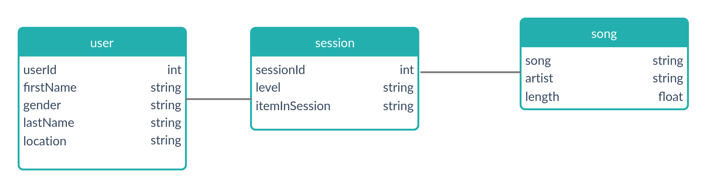

##### Udacity Data Engineering Nanodegree


# Project 2 : Data Modeling with Cassandra


   

About an ETL and modeling event data to create a non-relational database and ETL pipeline for a music streaming app. They will define queries and tables for a database built using Apache Cassandra.

### Table of contents

   - [About the project](#about-the-project)
   - [Purpose](#purpose)
   - [Getting started](#getting-started)
   - [Ressources](#ressources)
       - [Dataset EventData](#dataset-eventdata)
       - [Tools and Files](#tools-and-files)
   - [Worflow](#worflow)
      - [Modeling your NoSQL database](#modeling-your-nosql-database)
      - [Build ETL pipeline](#build-etl-pipeline)
   - [Workspace](#workspace)
      - [My environnemets](#my-environements)
      - [Discuss about the database](#discuss-about-the-database)
      - [Erd](#erd)
      - [Queries](#queries)
      - [Weblinks](#web-links)
  - [TODO](#todo)

<!--CACHER-->

## About the project

A startup called Sparkify wants to analyze the data they've been collecting on songs and user activity on their new music streaming app. The analysis team is particularly interested in understanding what songs users are listening to. Currently, there is no easy way to query the data to generate the results, since the data reside in a directory of CSV files on user activity on the app.  
They'd like a data engineer to create an Apache Cassandra database which can create queries on song play data to answer the questions.
* Create a database for this analyse
* Create Tables in Apache Cassandra
* Insert data
* Test the database by running queries

## Purpose

The purpose of this project is to apply data modeling with Apache Cassandra and build an ETL pipeline using Python.  
We will need to creating tables in Apache Cassandra to run queries.

## Getting started

* 

## Ressources

### Dataset EventData
 The directory of CSV files partitioned by date. Here are examples of filepaths to two files in the dataset:  

```python
event_data/2018-11-08-events.csv
event_data/2018-11-09-events.csv
```

### Tools and Files
To get started with the project, go to the workspace on the next page, where you'll find the project template (a Jupyter notebook file). You can work on your project and submit your work through this workspace.

The project template includes one Jupyter Notebook file, in which:
   * you will process the `event_datafile_new.csv` dataset to create a denormalized dataset
   * you will model the data tables keeping in mind the queries you need to run
   * you have been provided queries that you will need to model your data tables for
    * you will load the data into tables you create in Apache Cassandra and run your queries

## Worflow

### Modeling your NoSQL database
* Design tables to answer the queries outlined in the project template
* Write Apache Cassandra `CREATE KEYSPACE` and `SET KEYSPACE` statements
* Develop your `CREATE` statement for each of the tables to address each question
* Load the data with `INSERT` statement for each of the tables
* Include `IF NOT EXISTS` clauses in your `CREATE` statements to create tables only if the tables do not already exist. We recommend you also include `DROP TABLE` statement for each table, this way you can run drop and create tables whenever you want to reset your database and test your ETL pipeline
* Test by running the proper select statements with the correct `WHERE` clause
### Build ETL pipeline
* Implement the logic in section Part I of the notebook template to iterate through each event file in `event_data` to process and create a new CSV file in Python
* Make necessary edits to Part II of the notebook template to include Apache Cassandra CREATE and `INSERT` statements to load processed records into relevant tables in your data model
* Test by running `SELECT` statements after running the queries on your database

## Workspace

### My environnemets

* I create an anaconda environemet 'cassand3' with python=3.6
* check the java version
  * `java --version`
* Install Pandas, numpy, cassandra driver
  * `pip install pandas`
  * `pip install cassandra-driver`
* Install cassandra
  *  https://www-us.apache.org/dist/cassandra/3.11.5/apache-cassandra-3.11.5-bin.tar.gz
  * cd ~/Telechargement
  * chmod 755
  * tar -xvzf apache-cassandra-3.11.5.tar.gz
  * sudo mv apache-cassandra-3.11.5 /opt
  * sudo mv apache-cassandra-3.11.5 cassandra
  * sudo mkdir /var/lib/cassandra/
  * sudo mkdir /var/lib/cassandra/commitlog
  * sudo mkdir /var/lib/cassandra/data
  * sudo mkdir /var/log/cassandra/
  * sudo chown -R <USER> /var/lib/cassandra/ /var/log/cassandra/  *   
  _modifier le path dans .zshrc_
  * export CASSANDRA_HOME=/opt/cassandra
  * export PATH=$PATH:$CASSANDRA_HOME/bin:$CASSANDRA_HOME/sbin
* To work each time
  *  conda activate cassand3
  * cd /opt/cassandra
  * bin/cassandra -f #start cassandra
* /opt/cassandra/bin/nodetool status # cassandra is running?
  * start anaconda-navigator for Jupyter notebook

### Discuss about the database


